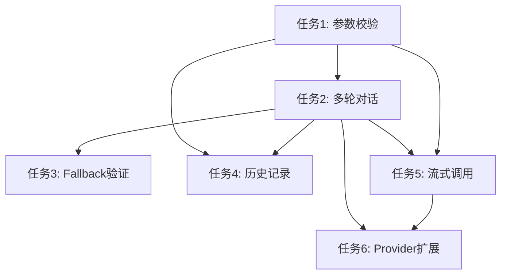

# 📋 实施计划：PPT Function Calling 系统进阶任务

> 基于 Codex + Gemini 双模型协作分析生成

## 任务类型
- [x] 前端 (→ Gemini)
- [x] 后端 (→ Codex)
- [x] 全栈 (→ 并行)

## 技术方案

### 综合分析结果

**Codex 分析要点**:
- 推荐方案 B 轻量版：在 `useLLMStream` 外拆出工具编排逻辑,保持改动可控
- 识别了 6 个高/中优先级任务,建议按依赖关系顺序实施
- 强调需要统一的错误/日志结构,避免跨 Provider 一致性问题

**Gemini 分析要点**:
- 指出 `fallbackCreateSlide` 函数不存在,`applySlideSpec` 已有安全机制
- 建议先实现参数校验(基础设施),再实现多轮对话(核心功能)
- 强调 UI 渐进式更新和用户反馈的重要性

**最终方案**:
- 采用 Codex 的架构方案 B 轻量版 + Gemini 的渐进式实施策略
- 任务顺序：参数校验 → 多轮对话 → Fallback 验证 → 历史记录 → 流式调用 → Provider 扩展
- 优先完成高优先级任务(1-3),中优先级任务(4-6)根据时间和资源情况实施

---

## 实施步骤

### 🔴 高优先级任务

#### 任务 1: 增强参数校验错误反馈
**优先级**: P0 (基础设施)
**预期产物**: 详细的 JSON 解析错误信息展示在 UI

**实施步骤**:
1. 扩展类型定义
   - 在 `src/types/index.ts` 中扩展 `ToolCall` 接口,添加 `parsingError?: string` 字段
   - 扩展 `ToolResult` 接口,添加 `errorCode?: string` 和 `errorDetails?: unknown` 字段

2. 修改 OpenAI Provider
   - 在 `src/core/llm/openai.ts` 的 `parseToolCalls` 方法中:
     - 捕获 `JSON.parse` 错误,不再静默返回空对象
     - 将解析错误信息存储在 `ToolCall.parsingError` 字段
     - 记录详细的错误日志(原始 JSON 字符串、错误位置等)

3. 修改工具注册表
   - 在 `src/core/tools/registry.ts` 的 `execute` 方法中:
     - 检查 `ToolCall.parsingError`,如果存在则直接返回错误结果
     - 返回结构化错误: `{ success: false, errorCode: 'PARSE_ERROR', error: '...', errorDetails: {...} }`

4. 更新 UI 组件
   - 在 `src/ui/components/chat/ToolExecutionCard.tsx` 中:
     - 区分显示"参数解析失败"和"工具执行失败"
     - 显示详细错误信息(可折叠展开)
     - 添加"复制错误信息"按钮

**关键文件**:
| 文件 | 操作 | 说明 |
|------|------|------|
| `src/types/index.ts` | 修改 | 扩展 `ToolCall` 和 `ToolResult` 接口 |
| `src/core/llm/openai.ts:55-79` | 修改 | 捕获 JSON 解析错误 |
| `src/core/tools/registry.ts:35-50` | 修改 | 检查解析错误并返回结构化错误 |
| `src/ui/components/chat/ToolExecutionCard.tsx` | 修改 | 显示详细错误信息 |

**风险与缓解**:
| 风险 | 缓解措施 |
|------|----------|
| 错误信息过于技术化,用户难以理解 | 提供用户友好的错误描述 + 技术详情(可折叠) |
| 错误信息可能包含敏感数据 | 过滤敏感字段(如 API Key) |

---

#### 任务 2: 实现完整的多轮对话循环
**优先级**: P0 (核心功能)
**预期产物**: 支持递归工具调用,LLM 可以根据工具结果继续调用其他工具或生成总结

**实施步骤**:
1. 重构 `executeStream` 函数
   - 在 `src/ui/hooks/useLLMStream.ts` 中:
     - 将 `executeStream` 改为递归函数,接受 `messages` 和 `depth` 参数
     - 添加递归深度限制(默认 5 层,可配置)
     - 每次递归时更新消息历史,包含工具调用和结果

2. 实现递归逻辑
   ```typescript
   const executeStream = async (
     msgs: ChatMessage[],
     depth: number = 0,
     maxDepth: number = 5
   ): Promise<void> => {
     if (depth >= maxDepth) {
       // 达到最大深度,返回警告消息
       return;
     }

     // 第一次 LLM 调用
     const response = await provider.send(...);

     if (response.toolCalls && response.toolCalls.length > 0) {
       // 执行工具
       const toolResults = await executeTools(response.toolCalls);

       // 构建新的消息历史
       const updatedMessages = [
         ...msgs,
         { role: 'assistant', content: response.content, toolCalls: response.toolCalls },
         ...toolResults.map(r => ({ role: 'tool', content: r.content, toolCallId: r.id }))
       ];

       // 递归调用
       await executeStream(updatedMessages, depth + 1, maxDepth);
     } else {
       // 没有工具调用,显示最终响应
       addMessage({ role: 'assistant', content: response.content });
     }
   };
   ```

3. 更新 UI 状态管理
   - 在递归过程中保持 `isStreaming` 状态
   - 每次工具执行后更新 UI,显示进度
   - 添加"停止"按钮,可以中断递归

4. 添加配置选项
   - 在 `appStore` 中添加 `maxToolCallDepth` 配置
   - 在设置页面添加配置项

**关键文件**:
| 文件 | 操作 | 说明 |
|------|------|------|
| `src/ui/hooks/useLLMStream.ts:296-461` | 重构 | 实现递归 `executeStream` 函数 |
| `src/ui/store/appStore.ts` | 修改 | 添加 `maxToolCallDepth` 配置 |
| `src/ui/components/settings/SettingsView.tsx` | 修改 | 添加深度限制配置项 |

**风险与缓解**:
| 风险 | 缓解措施 |
|------|----------|
| 无限递归导致性能问题 | 强制深度限制,默认 5 层 |
| 递归过程中用户体验不佳 | 显示递归进度,支持中断 |
| 消息历史过长导致 token 超限 | 监控 token 使用,必要时截断历史 |

---

#### 任务 3: 验证并优化 Fallback 逻辑
**优先级**: P1 (安全性验证)
**预期产物**: 确认当前 Fallback 逻辑安全,或修复潜在问题

**实施步骤**:
1. 代码审查
   - 验证 `applySlideSpec` 是否总是先创建新幻灯片
   - 检查是否有其他路径可能污染当前幻灯片
   - 审查 `slide-renderer.ts` 中的所有 fallback 逻辑

2. 添加安全检查(如需要)
   - 在 `ppt_create_slide` 工具中添加显式检查
   - 确保 fallback 前总是创建新幻灯片
   - 添加日志记录 fallback 触发情况

3. 添加用户确认机制(可选)
   - 如果 fallback 可能影响用户数据,添加确认对话框
   - 在 UI 中显示 fallback 警告

4. 添加配置选项
   - 在工具定义中添加 `allowFallback` 参数
   - 允许用户禁用 fallback 行为

**关键文件**:
| 文件 | 操作 | 说明 |
|------|------|------|
| `src/adapters/powerpoint/slide-renderer.ts:61-85` | 审查 | 验证新幻灯片创建逻辑 |
| `src/core/tools/ppt-tools.ts:100-108` | 修改 | 添加 fallback 安全检查 |
| `src/ui/components/chat/MessageBubble.tsx` | 修改 | 显示 fallback 警告(如需要) |

**风险与缓解**:
| 风险 | 缓解措施 |
|------|----------|
| 过度保守的检查影响用户体验 | 仅在必要时显示警告 |
| 配置选项增加复杂度 | 提供合理的默认值 |

---

### 🟡 中优先级任务

#### 任务 4: 添加工具调用历史记录
**优先级**: P2 (调试工具)
**预期产物**: 开发者页面显示完整的工具调用历史

**实施步骤**:
1. 扩展状态管理
   - 在 `src/ui/store/appStore.ts` 中:
     - 添加 `toolHistory: ToolHistoryEntry[]` 状态
     - 添加 `addToolLog(entry: ToolHistoryEntry)` 方法
     - 添加 `clearToolHistory()` 方法

2. 记录工具调用
   - 在 `src/ui/hooks/useLLMStream.ts` 中:
     - 每次工具执行后调用 `addToolLog`
     - 记录: 时间戳、工具名称、参数、结果、耗时、是否成功

3. 创建历史记录 UI
   - 创建 `src/ui/components/developer/sections/ToolHistorySection.tsx`
   - 显示表格: 时间 | 工具 | 参数 | 结果 | 耗时 | 状态
   - 支持筛选(成功/失败)和搜索
   - 支持导出为 JSON

4. 集成到开发者页面
   - 在 `src/ui/components/developer/DeveloperPage.tsx` 中添加新 Section

**关键文件**:
| 文件 | 操作 | 说明 |
|------|------|------|
| `src/ui/store/appStore.ts` | 修改 | 添加 `toolHistory` 状态 |
| `src/ui/hooks/useLLMStream.ts` | 修改 | 记录工具调用 |
| `src/ui/components/developer/sections/ToolHistorySection.tsx` | 新建 | 历史记录 UI |
| `src/ui/components/developer/DeveloperPage.tsx` | 修改 | 集成新 Section |

---

#### 任务 5: 支持流式工具调用
**优先级**: P2 (性能优化)
**预期产物**: 使用 `provider.stream()` 实现流式工具调用

**实施步骤**:
1. 研究 OpenAI 流式 tool_calls 格式
   - 理解 `delta.tool_calls` 的增量格式
   - 实现 tool_calls delta 累积逻辑

2. 修改 `useLLMStream`
   - 将 `provider.send()` 改为 `provider.stream()`
   - 实现 tool_calls 增量解析和累积
   - 在 UI 中实时显示工具调用进度

3. 更新类型定义
   - 在 `src/types/index.ts` 中添加流式 tool_calls 相关类型

**关键文件**:
| 文件 | 操作 | 说明 |
|------|------|------|
| `src/ui/hooks/useLLMStream.ts` | 重构 | 使用 `stream()` 代替 `send()` |
| `src/core/llm/openai.ts` | 修改 | 支持流式 tool_calls 解析 |
| `src/types/index.ts` | 修改 | 添加流式类型定义 |

---

#### 任务 6: 扩展 Anthropic 和 Gemini Provider
**优先级**: P2 (功能扩展)
**预期产物**: Anthropic 和 Gemini Provider 支持工具调用

**实施步骤**:
1. Anthropic Provider
   - 研究 Anthropic Tool Use API 格式
   - 在 `src/core/llm/anthropic.ts` 中:
     - 实现 `tools` 参数转换
     - 实现 `tool_use` 响应解析
     - 实现 `tool_result` 消息构建

2. Gemini Provider
   - 研究 Gemini Function Calling API 格式
   - 在 `src/core/llm/gemini.ts` 中:
     - 实现 `tools` 参数转换
     - 实现 `functionCall` 响应解析
     - 实现 `functionResponse` 消息构建

3. 统一接口
   - 确保三个 Provider 的工具调用接口一致
   - 在 `factory.ts` 中添加 Provider 能力检测

**关键文件**:
| 文件 | 操作 | 说明 |
|------|------|------|
| `src/core/llm/anthropic.ts` | 修改 | 实现 Tool Use 支持 |
| `src/core/llm/gemini.ts` | 修改 | 实现 Function Calling 支持 |
| `src/core/llm/factory.ts` | 修改 | 添加能力检测 |

---

## 实施顺序与依赖关系



**实施建议**:
1. **第一阶段** (高优先级): 任务 1 → 任务 2 → 任务 3
2. **第二阶段** (中优先级): 任务 4 → 任务 5 → 任务 6
3. 每个任务完成后进行测试和代码审查
4. 所有任务完成后进行集成测试

---

## 测试策略

### 单元测试
- `parseToolCalls` 的错误处理逻辑
- `executeStream` 的递归逻辑
- 工具历史记录的存储和检索

### 集成测试
- 完整的多轮对话流程
- 工具调用失败后的错误处理
- 跨 Provider 的工具调用一致性

### E2E 测试
- 用户发起工具调用请求
- 工具执行成功/失败场景
- 递归工具调用场景

---

## SESSION_ID (供 /ccg:execute 使用)

- **CODEX_SESSION**: `019bd01f-ba64-7980-99eb-1bab7ba9c223`
- **GEMINI_SESSION**: `2be26697-247e-4824-b6f0-18b78f88cb74`

---

## 附录: 双模型分析摘要

### Codex 分析要点
- 推荐方案 B 轻量版：抽象工具编排层,集中处理递归、流式聚合、错误/历史
- 识别了架构清晰度和可维护性的重要性
- 强调需要统一的错误码和日志结构

### Gemini 分析要点
- 指出 `fallbackCreateSlide` 不存在,当前实现已经安全
- 强调用户体验和渐进式更新
- 建议先实现基础设施(参数校验),再实现核心功能(多轮对话)

### 综合决策
- 采用 Codex 的架构方案 + Gemini 的实施策略
- 任务顺序优化为: 参数校验 → 多轮对话 → Fallback验证 → 历史 → 流式 → Provider扩展
- 平衡长期架构和短期交付

---

**最后更新**: 2026-01-18
**计划版本**: v1.0
**预计工作量**: 高优先级 3-5 天,中优先级 3-5 天
