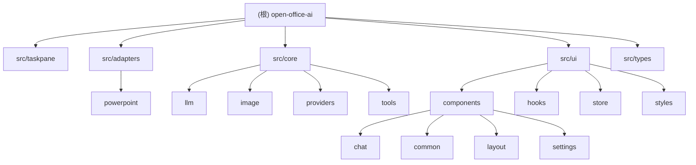

# Open Office AI

> AI 驱动的 Office 文档编辑助手 - PowerPoint Add-in

## 项目愿景

Open Office AI 是一个 Microsoft Office 插件，旨在将 AI 能力无缝集成到 PowerPoint 中，帮助用户：
- 智能改写、润色、翻译文档内容
- 基于自然语言指令自动生成幻灯片
- 通过 AI 图片生成增强演示文稿视觉效果

## 架构总览

```
src/
├── taskpane/          # Office Add-in 入口
├── adapters/          # Office API 适配层
│   └── powerpoint/    # PowerPoint 专用适配器
├── core/              # 核心业务逻辑
│   ├── llm/           # LLM 提供商抽象
│   ├── image/         # 图片生成服务
│   ├── providers/     # 供应商适配器系统（新）
│   └── tools/         # Function Calling 工具集
├── ui/                # React UI 组件
│   ├── components/    # 可复用组件
│   ├── hooks/         # 自定义 Hooks
│   ├── store/         # Zustand 状态管理
│   └── styles/        # 设计系统
└── types/             # TypeScript 类型定义
```

## 模块结构图



## 模块索引

| 模块路径 | 职责 | 入口文件 | 关键依赖 |
|---------|------|---------|---------|
| `src/taskpane` | Office Add-in 入口，初始化 React 应用 | `index.tsx` | React, Fluent UI, Office.js |
| `src/adapters/powerpoint` | PowerPoint API 封装，文档操作适配 | `index.ts` | Office.js |
| `src/core/llm` | LLM 提供商抽象，支持 OpenAI/Anthropic | `factory.ts` | - |
| `src/core/image` | AI 图片生成服务 | `provider.ts` | - |
| `src/core/providers` | 供应商适配器系统，统一能力路由 | `executor.ts` | - |
| `src/core/tools` | Function Calling 工具注册表 | `registry.ts` | - |
| `src/ui` | React UI 组件库 | - | React, Fluent UI, Zustand |
| `src/types` | TypeScript 类型定义 | `index.ts` | - |

## 运行与开发

### 环境要求
- Node.js 18+
- Microsoft Office (PowerPoint) 桌面版或 Web 版

### 开发命令
```bash
# 安装依赖
npm install

# 启动开发服务器 (https://localhost:3001)
npm run dev

# 构建生产版本
npm run build

# 类型检查
npm run typecheck

# 代码检查
npm run lint

# 启动 Office Add-in 调试
npm run start

# 验证 manifest
npm run validate
```

### 首次运行
1. 运行 `npm run dev` 启动开发服务器
2. 在 PowerPoint 中加载 `manifest.xml`
3. 点击 "Home" 选项卡中的 "Open Office AI" 按钮

## 测试策略

当前项目暂无自动化测试。建议添加：
- 单元测试：LLM Provider、SlideSpec 解析器
- 集成测试：PowerPoint API 适配器
- E2E 测试：完整的幻灯片生成流程

## 编码规范

### TypeScript
- 严格模式 (`strict: true`)
- 使用路径别名：`@/`, `@core/`, `@adapters/`, `@ui/`, `@types/`
- 接口命名以 `I` 前缀（如 `ILLMProvider`）
- 类型命名使用 PascalCase

### React
- 函数组件 + Hooks
- 使用 Fluent UI React v9 组件库
- 样式使用 `makeStyles` (Griffel)
- 状态管理使用 Zustand

### 文件组织
- 组件文件使用 PascalCase
- Hook 文件使用 camelCase，以 `use` 前缀
- 每个模块目录可包含 `index.ts` 作为公共导出

## AI 使用指引

### 代码生成
- 生成 React 组件时使用 Fluent UI v9 组件
- 遵循现有的 `makeStyles` 样式模式
- 新增 LLM Provider 需实现 `ILLMProvider` 接口

### 上下文理解
- `SlideSpec` 是幻灯片生成的核心数据结构
- PowerPoint API 调用需在 `PowerPoint.run()` 上下文中执行
- 状态管理集中在 `appStore.ts`

### 常见任务
1. **添加新的供应商适配器**：在 `src/core/providers/adapters/` 创建新适配器类，实现 `ProviderAdapter` 接口
2. **添加新的 UI 组件**：在 `src/ui/components/` 对应目录创建
3. **扩展 SlideSpec**：修改 `src/types/slide-spec.ts`
4. **添加 Function Calling 工具**：在 `src/core/tools/` 注册新工具

## 核心系统说明

### 供应商适配器系统

**架构**：
```
ProviderExecutor (统一执行层)
    ↓
ProviderRegistry (注册表)
    ↓
ProviderAdapter (适配器接口)
    ↓
具体适配器 (OpenAI, Gemini, GLM, Doubao, etc.)
```

**支持的供应商**：
- OpenAI (文本 + 图片)
- Gemini (文本 + 图片)
- GLM (文本 + 图片)
- Doubao (文本 + 图片)
- DeepSeek Janus (文本 + 图片)
- Grok (文本 + 图片)
- Qianfan (文本 + 图片)
- DashScope (文本 + 图片)

**核心功能**：
1. **统一执行层** (`ProviderExecutor`)
   - 按能力选择连接（手动优先 → 自动候选）
   - 构建请求（buildTextRequest / buildImageRequest）
   - 执行 HTTP（应用代理 / URL 规范化）
   - 解析响应（parseTextResponse / parseImageResponse）
   - 错误映射与重试（仅对可重试错误触发）

2. **降级策略**
   - 自动尝试下一个候选提供商
   - 仅对以下错误触发重试：
     - `rate_limited` - 速率限制
     - `timeout` - 超时
     - `provider_unavailable` - 提供商不可用

3. **图片数据规范化**
   - 自动处理 URL → base64 转换
   - 验证 base64 数据完整性
   - 超时保护（60秒）

**使用示例**：
```typescript
import { ProviderExecutor } from '@core/providers';

const executor = new ProviderExecutor();

// 文本生成
const result = await executor.executeText(
  connections,
  { prompt: '你好', options: { temperature: 0.7 } },
  generationProfile
);

// 图片生成
const imageResult = await executor.executeImage(
  connections,
  { prompt: '一只猫', size: '1024x1024' },
  generationProfile
);
```

### Function Calling 系统

**架构**：
```
ToolRegistry (工具注册表)
    ↓
Tool Definition (工具定义)
    ↓
Tool Handler (工具处理器)
```

**已注册工具**：
- `ppt_create_slide` - 创建幻灯片
- `ppt_insert_image` - 插入图片
- `ppt_set_background` - 设置背景
- `ppt_replace_selection` - 替换选中文本
- `ppt_insert_text` - 插入文本框
- `ppt_get_context` - 获取演示文稿上下文
- `generate_text` - 生成文本
- `generate_image` - 生成图片

**使用示例**：
```typescript
import { getToolRegistry } from '@core/tools/registry';
import { registerPPTTools } from '@core/tools/ppt-tools';

// 初始化工具注册表
const registry = getToolRegistry();
registerPPTTools(registry);

// 执行工具
const result = await registry.execute('ppt_create_slide', {
  layout: 'title-content',
  title: '我的标题',
  content: ['要点1', '要点2']
});
```

## 变更记录 (Changelog)

### 2026-01-20
- **重大更新**：实现供应商适配器系统和能力路由
  - 新增 `ProviderExecutor` 统一执行层
  - 重构 `ImageGenerationProvider` 使用适配器模式
  - 支持 8 个供应商的文本和图片生成能力
  - 实现多提供商动态路由和降级策略
  - 添加图片数据规范化和验证
  - UI 增强：设置页面显示能力标签（文本/图片）
- **Function Calling 系统**：完成多轮对话工具调用
  - 注册 8 个 PPT 操作工具
  - 支持文本和图片生成工具
  - 集成 OpenAI Function Calling

### 2026-01-15
- 初始化项目架构文档
- 完成全仓扫描，覆盖率 100%
